# Insurance lakehouse skeleton

A local, laptop-runnable mirror of a **Databricks-on-AWS lakehouse** for a motor
and health insurtech: seeded synthetic insurance data with deliberate defects,
config-driven bronze ingestion into Delta, a dbt silver/gold star schema that
answers real insurance questions, Airflow orchestration, PII governance that
generates Unity Catalog SQL from metadata, and observability. It exists to be
**adapted in a day**, not admired: registering a new source is a YAML edit, and
every architectural choice is recorded with the evidence behind it.

```bash
make setup      # venv, deps, Java 17 check
make all        # generate -> bronze -> dbt build -> report
make demo       # day 1 -> day 2, then prove every hard case was handled
```

---

## Architecture

```mermaid
flowchart LR
    subgraph SRC["Sources"]
        P["Partner CSV drops<br/>3 divergent schemas"]
        E["Microservice events<br/>JSON lines"]
        C["CDC feed<br/>op I/U/D + ts"]
        R["Reference data<br/>products, FX, partners"]
    end

    subgraph BRZ["Bronze — land raw"]
        B["Delta tables<br/>_ingested_at, _source_file<br/>_batch_id, _record_hash"]
        M["Manifest table<br/>idempotency"]
        Q["Quarantine<br/>+ reason"]
        D["Schema-drift audit"]
    end

    subgraph SLV["Silver — clean and conform"]
        S1["Staging<br/>dedup, BE→CE dates<br/>partner harmonisation<br/>FX to THB"]
        S2["Incremental MERGE<br/>claims lookback window"]
        S3["SCD2 snapshot<br/>check strategy"]
    end

    subgraph GLD["Gold — star schema"]
        DIM["dim_customer (masked)<br/>dim_vehicle, dim_product<br/>dim_partner, dim_date"]
        FCT["fct_written_premium<br/>fct_earned_premium<br/>fct_claims"]
    end

    subgraph MRT["Marts"]
        M1["mart_loss_ratio"]
        M2["mart_quote_conversion"]
        M3["mart_claims_lag"]
    end

    SRC --> BRZ --> SLV --> GLD --> MRT --> BI["BI / ML"]

    subgraph GOV["Governance"]
        G1["PII in dbt meta<br/>+ config/sources.yml"]
        G2["mask_pii() macro"]
        G3["unity_catalog.sql<br/>tags, masks, row filters"]
    end

    subgraph OBS["Observability"]
        O1["Source freshness SLAs"]
        O2["Test results → Delta"]
        O3["observability.html"]
    end

    GOV -.governs.-> SLV
    GOV -.governs.-> GLD
    OBS -.monitors.-> BRZ
    OBS -.monitors.-> SLV
    OBS -.monitors.-> GLD

    AF["Airflow / Astro<br/>idempotent, backfillable"] -.orchestrates.-> BRZ
    AF -.orchestrates.-> SLV
    AF -.orchestrates.-> GLD
```



---

## What it produces

`make demo` runs day 1, then day 2, then prints proof:

```
LOSS RATIO by product
product        cover_class   earned_thb  loss_ratio  frequency  severity_thb
HEALTH_ADJ     health        7,133,000   0.618       0.096      176,103
MOTOR_CMI      compulsory      320,000   0.618       0.070        6,330
MOTOR_VOL_C3   class_3       1,620,000   0.505       0.077       45,506
MOTOR_VOL_C1   class_1       6,970,000   0.458       0.070      132,878

DEMO SUMMARY: 10/10 checks passed
  PASS  dedup collapses resent records
  PASS  late claims were merged, not appended
  PASS  the lookback window covers the observed tail
  PASS  SCD2 captured more than one version for at least one policy
  PASS  no overlapping validity windows
  PASS  no raw PII survives into gold
  PASS  hashed IDs remain join-keys (deterministic, not redacted)
  PASS  the checksum test finds genuinely invalid IDs
  PASS  unparseable records were quarantined, not dropped
```

---

## Repo map

| Path | What it is |
|---|---|
| `config/sources.yml` | **The source registry.** 16 sources. Adding one is a YAML edit, not code. |
| `conf/spark-defaults.conf` | Delta config + laptop tuning, shared by PySpark and dbt (ADR-0003) |
| `data_generator/` | Seeded synthetic insurance universe; 13 toggleable defects |
| `ingestion/` | Generic bronze engine: manifest, quarantine, drift audit, Delta maintenance |
| `dbt/` | Silver + gold, two targets (local Spark / Databricks), macros, tests |
| `airflow/` | Astro project and the DAG |
| `governance/` | PII metadata → Unity Catalog SQL |
| `scripts/` | Demo proof, observability report, inspection, doc generation |
| `docs/` | Domain primer, data model, decisions, Databricks port, playbook, interview prep |

---

## Key design decisions

Full reasoning and evidence in [`docs/decisions.md`](docs/decisions.md).

| Decision | Why |
|---|---|
| **Bronze lands raw** | Cleaning is silver's job. A bad silver rule is then recoverable without re-ingesting. |
| **Quarantine is narrow** (ADR-0007) | Only unparseable records and records with no primary key. Negative premiums must reach silver so tests can *measure* them — dropping them at bronze hides the signal. |
| **Manifest, not checkpoint** (ADR-0006) | Local stand-in for Auto Loader. Identity is `(path, size, mtime)`, so a partner overwriting a file with corrections is re-ingested rather than skipped. |
| **CSV files grouped by header** (ADR-0008) | Spark infers CSV schema from a *sample*; a drifted column would otherwise be dropped depending on which files it saw. |
| **SCD2 uses `check`, not `timestamp`** | Backdated endorsements have `effective_date` before `requested_date`; a timestamp strategy would silently skip them. |
| **Claims lookback = 60 days** | Not a guess: `mart_claims_lag` measured p99 reporting lag at 60 days with 25 claims falling outside a 30-day window. |
| **FX by validity window, not exact date** | An exact-date join silently NULLs every weekend and holiday transaction. Rates carry forward, as treasury systems do. |
| **Test severity is deliberate** (ADR-0014) | `error` for accounting identities, `warn` for quality signals the generator injects. The build stays green while defects stay visible. |
| **Astro Runtime pinned by Python** (ADR-0010) | Runtime 3.3 ships Python 3.14, which PySpark 3.5.9 does not support. |
| **Probe Delta features, don't assume** (ADR-0009) | Two confident assumptions turned out wrong. `make maintenance` tests rather than asserts. |

---

## Production on Databricks / AWS

What changes when this runs for real. Component-by-component mapping in
[`docs/databricks_port.md`](docs/databricks_port.md).

### Ingestion — Auto Loader over the manifest

`ingestion/bronze.py`'s manifest table exists because OSS has no `cloudFiles`
equivalent. In production it is replaced by **Auto Loader** reading from S3 with
`cloudFiles.schemaEvolutionMode=addNewColumns` and file notification mode (SQS)
rather than directory listing — listing a bucket with millions of objects is
slow and expensive. The quarantine and drift-audit patterns carry over unchanged;
they are application logic, not a workaround.

### Lakeflow Declarative Pipelines vs dbt

**Keep dbt.** Declarative Pipelines give you expectations, managed
orchestration and automatic incrementalisation, and they are genuinely good for
streaming-first ingestion. But dbt is portable, its tests and docs are already
written here, and the team's SQL skills transfer. The honest split: Declarative
Pipelines for streaming bronze/silver where the managed checkpointing earns its
keep; dbt for the analytical gold layer where lineage, docs and testing matter
more. Running both is defensible; running neither properly is not.

### Compute — serverless vs classic

- **Serverless SQL** for dbt and BI. Sub-10-second start, per-second billing,
  no idle cost. For a nightly `dbt build` of this size that is decisively
  cheaper than keeping a cluster warm.
- **Classic job clusters** for heavy Spark work needing specific instance types,
  spot instances, or libraries serverless will not host. Spot with on-demand
  driver typically saves 60–70% on non-urgent batch.
- **Never interactive clusters for production jobs.** The most common Databricks
  cost leak is an all-purpose cluster left running because a job was scheduled
  against it.

### Storage layout and file sizing

Liquid clustering rather than partitioning on the high-volume tables —
`fct_claims` clustered by `(loss_date, product_code)`. Note the constraint found
here by probing: **clustering and Hive-style partitioning are mutually
exclusive**, so bronze's `_batch_date` partitioning is replaced, not
supplemented. Enable predictive optimization so `OPTIMIZE` and `VACUUM` run from
usage telemetry instead of a cron job someone forgets to maintain.

### Unity Catalog layout

**Catalog per environment, schema per layer.**

```
insurance_dev   /  bronze  silver  gold  marts  observability
insurance_uat   /  ...
insurance_prod  /  ...
```

Promotion is a catalog swap; the same dbt project builds against all three,
which is exactly what the two profiles here demonstrate in miniature. Groups:
`data_engineers` (full on dev, read on prod), `analysts` (gold and marts only),
`restricted_health` (the sole group that can read unmasked health columns).

### Networking — S3, VPC, PrivateLink

- Workspace in a **customer-managed VPC** with private subnets; no public IPs on
  compute.
- **S3 gateway VPC endpoint** for bucket traffic. This is free and keeps S3
  traffic off the NAT gateway — NAT data-processing charges on a lakehouse
  reading terabytes from S3 are a large, entirely avoidable line item, and it is
  the single highest-leverage networking decision on the list.
- **Interface endpoints (PrivateLink)** for the Databricks control plane and
  the secure cluster connectivity relay, so cluster↔control-plane traffic never
  crosses the internet.
- Bucket policies restricted to the workspace role; SSE-KMS with a
  customer-managed key; versioning on, with lifecycle rules expiring old
  versions so time travel does not become an unbounded bill.

### Streaming — Kafka and CDC

The `cdc_policies` feed here is a file-based stand-in for Debezium. In
production: Debezium → Kafka (MSK) → **Structured Streaming** with
`availableNow` triggers for near-real-time micro-batches, checkpointing to S3.
Delta's atomic commit plus Structured Streaming's checkpoint gives
exactly-once **into Delta** even from an at-least-once source, which is the
practical guarantee worth designing for. Partition Kafka by policy ID so
per-key ordering holds, and handle tombstones explicitly — unhandled deletes
leave rows alive downstream forever.

### CI/CD — Databricks Asset Bundles

Replace the Makefile-driven deploy with **DABs**: `databricks.yml` defining jobs,
pipelines and permissions per target, `databricks bundle deploy -t prod` from CI,
with the same dbt project built in a job. Bundles put job definitions in version
control, which is the thing that makes a workspace reproducible rather than
archaeological.

### Monitoring and alerting

Lakehouse Monitoring on gold tables for drift and data-quality metrics; system
tables (`system.billing.usage`, `system.access.audit`) for cost and access;
alerts on **freshness SLA breach** (already declared in `config/sources.yml`),
test failures by severity, and job duration regression. Route to PagerDuty with
the fields the failure callback here already collects: table, logical date,
upstream source. A page that does not say which table and which date starts an
investigation rather than ending one.

### Rolling this out to a team

1. **Standards first, in the repo.** `CLAUDE.md` and `docs/decisions.md` are
   the model: conventions written down where the work happens, with the
   reasoning attached so they can be argued with.
2. **Make the paved road the easy road.** A new source is a YAML edit. If doing
   it properly is harder than doing it ad hoc, people do it ad hoc.
3. **Ownership per domain**, with a named owner per source and per mart, in
   `config/sources.yml` where it cannot drift from the code.
4. **Review focused on grain, tests and PII classification** — the three things
   that are expensive to fix later. Not formatting; ruff and sqlfluff own that.
5. **Cost visible weekly**, per job and per team, from system tables. Cost that
   nobody sees is cost that nobody manages.

---

## Requirements

- Python 3.11, **Java 17** (Spark 3.5 rejects Java 21 — `make check-java` verifies)
- macOS or Linux; Windows via WSL2
- Docker only for the container and Airflow paths

## Documentation

| Document | Contents |
|---|---|
| [`docs/insurance_domain_primer.md`](docs/insurance_domain_primer.md) | The lifecycle, every entity's grain, the metrics and their traps, Thai พ.ร.บ. vs ชั้น 1/2/3, adjustable health |
| [`docs/data_model.md`](docs/data_model.md) | ERD and the grain of every table |
| [`docs/decisions.md`](docs/decisions.md) | ADRs with the evidence behind each |
| [`docs/databricks_port.md`](docs/databricks_port.md) | Component-by-component port mapping |
| [`docs/ASSIGNMENT_PLAYBOOK.md`](docs/ASSIGNMENT_PLAYBOOK.md) | Day-1 checklist for adapting to a new brief |
| [`docs/INTERVIEW_PREP.md`](docs/INTERVIEW_PREP.md) | Technical topics, each grounded in this code |
| [`CLAUDE.md`](CLAUDE.md) | Conventions and gotchas for future sessions |
