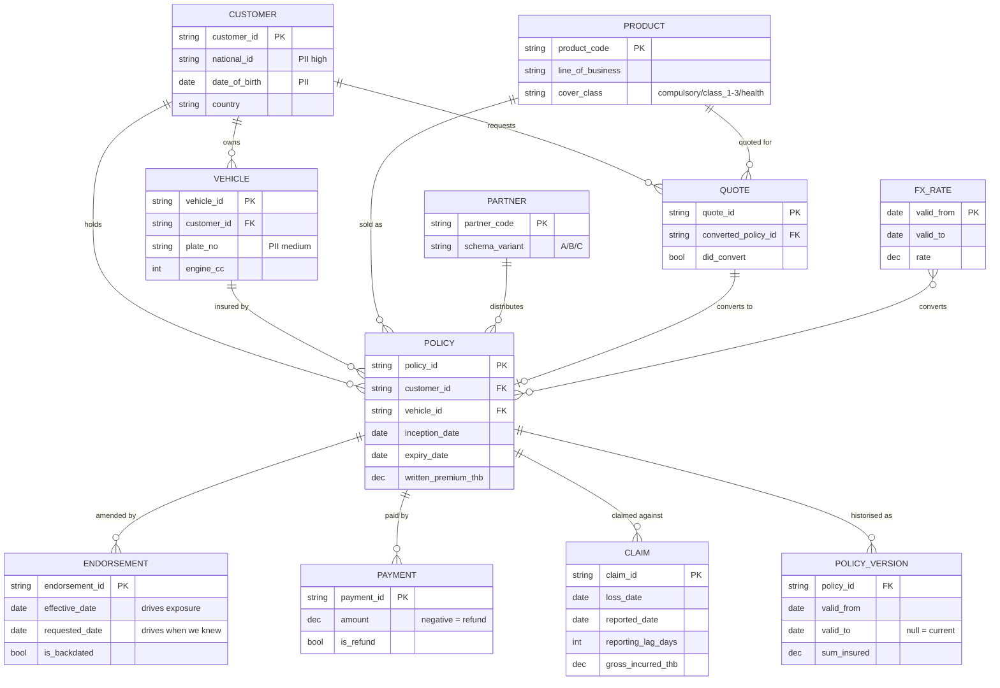

# Data model

Grain, keys and lineage for every table. The grain statement is the contract:
if you cannot say what one row means in a sentence, the model is not finished.

---

## ERD — silver and gold

---

## Bronze

Every bronze table carries `_ingested_at`, `_source_file`, `_batch_id`,
`_record_hash`, `_source_name`, `_batch_date`. `_record_hash` covers business
columns only, so a record resent verbatim hashes identically.

| Table | Grain | Key |
|---|---|---|
| `partner_policies_a/b/c` | One row per file line, as delivered | `policy_no` / `PolicyNumber` / `nomor_polis` |
| `partner_claims_a/b/c` | One row per file line | `claim_no` / `ClaimNumber` / `nomor_klaim` |
| `events_quotes` | One event | `quote_id` |
| `events_endorsements` | One event | `endorsement_id` |
| `events_premium_payments` | One event | `payment_id` |
| `events_claims` | One event | `claim_id` |
| `cdc_policies` | One **change event** | `(policy_id, ts)` |
| `ref_*` | One row per snapshot row | natural key |
| `*_quarantine` | One unlandable record + reason | none by definition |
| `_ingestion_manifest` | One ingested file | `(source_name, file_path, file_size, file_modified_at)` |
| `_schema_audit` | One drift event | `(source_name, batch_id)` |

## Silver

| Model | Grain | Notes |
|---|---|---|
| `stg_partner_policies` | One row per `policy_id`, latest version | Three schemas unified; dedup tie-break documented in `dedupe_latest()` |
| `stg_partner_claims` | One row per `claim_no` | No source timestamp, so dedup is best-effort — stated in the model docs |
| `stg_quotes` | One row per `quote_id` | |
| `stg_endorsements` | One row per `endorsement_id` | `effective_date` and `requested_date` kept separate |
| `stg_premium_payments` | One row per `payment_id` | Negative amounts are refunds |
| `stg_claims` | One row per `claim_id` | `reporting_lag_days` recomputed, not trusted |
| `stg_policies_cdc` | One row per `(policy_id, change_ts)` | Full change history retained |
| `stg_customers` / `stg_vehicles` / `stg_products` / `stg_partners` | One row per natural key | SCD1 |
| `stg_fx_rates` | One row per `(from, to, valid_from)` | Validity windows, not point dates |
| `silver_policies` | One row per `policy_id` — current state | Incremental MERGE; CDC beats partner; `op='D'` excluded |
| `silver_claims` | One row per `claim_id` | Incremental MERGE with 60-day lookback |
| `silver_premium_payments` | One row per `payment_id` | Incremental MERGE |
| `policies_snapshot` | One row per `(policy_id, version)` | SCD2, **check** strategy |
| `silver_policy_as_of` | One row per `(policy_id, valid_from)` | Half-open `[valid_from, valid_to)` |

## Gold

| Model | Grain |
|---|---|
| `dim_customer` | One row per `customer_id` — PII masked |
| `dim_vehicle` | One row per `vehicle_id` |
| `dim_product` | One row per `product_code` |
| `dim_partner` | One row per `partner_code` |
| `dim_date` | One row per calendar date |
| `fct_written_premium` | One row per `policy_id` |
| `fct_earned_premium` | One row per **`(policy_id, month_start)`** |
| `fct_claims` | One row per `claim_id` |

## Marts

| Mart | Grain | Answers |
|---|---|---|
| `mart_loss_ratio` | `(year_month, country, partner_code, product_code)` | Loss ratio, claim frequency, severity — with a credibility flag |
| `mart_quote_conversion` | `(quote_year_month, country, partner_code, product_code, channel)` | Conversion rate by channel |
| `mart_claims_lag` | `(loss_year_month, country, product_code)` | Reporting-delay percentiles; whether the lookback window is wide enough |

---

## Three grain traps in this model

1. **`fct_earned_premium` is per policy-month, not per policy.** Summing
   `earned_premium_thb` without grouping by month is meaningful; joining it to a
   per-policy table without aggregating first silently fans out every row.
2. **`silver_policy_as_of` is per version.** A point-in-time query must filter
   `D >= valid_from and D < coalesce(valid_to, '9999-12-31')`, or one policy
   returns several rows and exposure doubles.
3. **`cdc_policies` is per change event.** It looks like a policy table and is
   not. Collapsing to current state happens in `silver_policies`.
